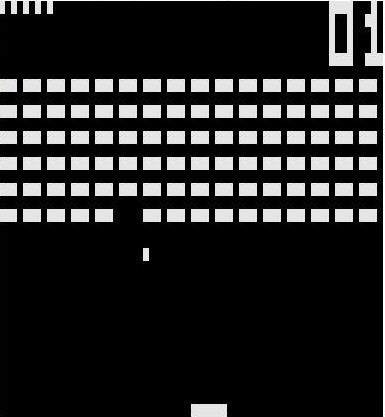

# Chip8 experiments

### Emulator `emu.c`

A simple Chip8 emulator, capable of running every binary file built on the original Chip8 specs directly in the terminal.

Well, in theory - up to now I've tried to run the ROMs that you can find in the `roms` folder, and they roughly work but with two big problems:

1. In `BRIX` the user pad has to be redrawn constantly, also if it stays still; the result is an annoying flickering. I'm working on this.
2. In `BRIX`, `TETRIS` and probably every other program that requires asynchronous input from the user, said input is often missed by the emulator. Again, quite annoying, but I'm working on it.

Before running it, you must compile it with the following command (requires `ncurses`):

	gcc emu.c main.c -lncurses -o main
    
Then simply run `./main path/to/rom` and (hopefully) voilà! It's advisable to adjust the terminal windows size to 64x32 for the maximum pleasure experience. Sooner or later I'll make this step automatic, but until then... the manual way is preferred.

Inside the emulator you can also find a disassembler and a (at the moment I'm writing) stupid and useless debugger; these features can be enabled by adjusting the `#define DEBUG 0` line in `emu.h` as desired. I'll need to refactor these three components in the future, because now they are quite a bit complicated to set up.

### Compiler `compiler/compiler.py`

A simple compiler (which actually is just an assembler) that goes from a `Chip8` assembly file to a `binary` file. The mnemonics and the exact specs of the "high-level" language is still not down on paper, we'll work on this; for now, the contents in `compiler/opcodes.py` are the only documentation avaliable.

The syntax for the compiler is:

	python compiler.py input_file_name output_file_name
